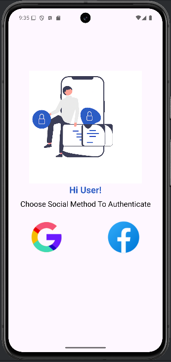
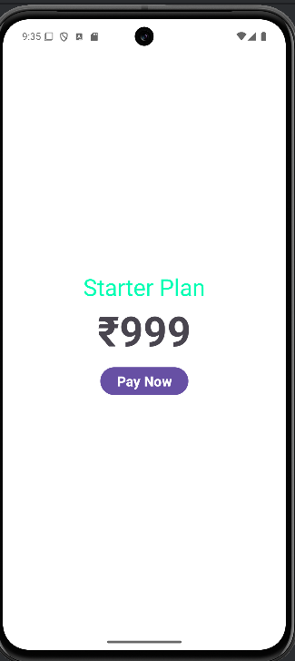
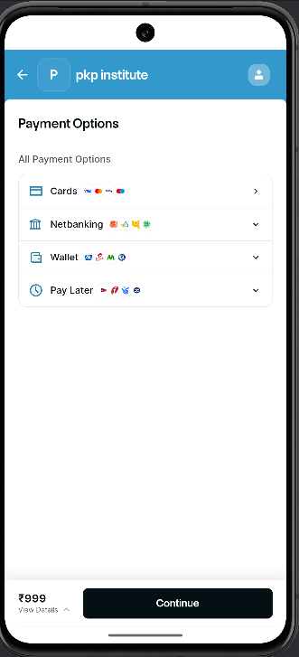
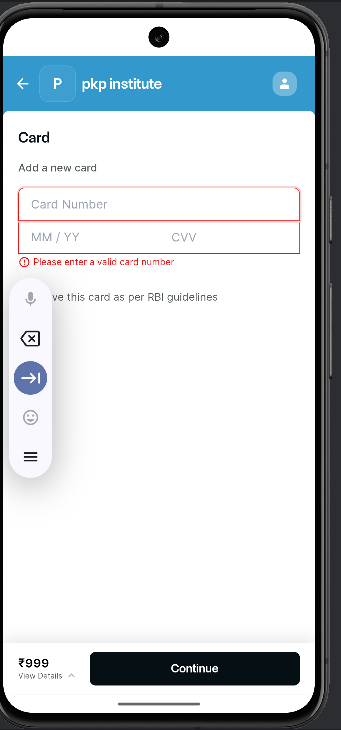

# 🚀 Flying Payment Gateway App  

    
  
  

An Android app that integrates **Google/Facebook Authentication** with **Razorpay Payment Gateway** for secure and seamless online payments.  
This project demonstrates **real-world payment integration** in mobile apps, suitable for learning and practical use.  

---

## 📌 Features  

- 🔑 **Authentication**
  - Google Sign-in  
  - Facebook Sign-in  

- 💳 **Payment Gateway (Razorpay Integration)**  
  - Pay using Credit/Debit Cards  
  - Netbanking support  
  - Wallets (Paytm, PhonePe, Freecharge, etc.)  
  - Pay Later options  

- 🔒 **Security Features**  
  - Card number & CVV validation  
  - RBI-compliant card storage option  

- 🎨 **User Interface**  
  - Modern & clean UI design  
  - Simple splash screen with app logo  
  - Interactive buttons and error handling  

---

## 📱 Screenshots & Flow  

### 1️⃣ Splash Screen  
- On launch, users see a simple splash screen with the **Flying logo**.  

  

---

### 2️⃣ Social Authentication Screen  
- The user starts by logging in with **Google or Facebook**.  
- This ensures only authenticated users can access payment features.  

  

---

### 3️⃣ Payment Plan Screen  
- After login, users can select a subscription plan.  
- In this demo, the **Starter Plan** costs ₹999.  

  

---

### 4️⃣ Razorpay Payment Options  
- Razorpay offers **multiple ways** to pay:  
  - Cards  
  - Netbanking  
  - Wallets  
  - Pay Later  

  

---

### 5️⃣ Card Payment Validation  
- If the user chooses to pay by **Card**, the app validates inputs.  
- Wrong card numbers trigger an error message.  

  

## 🛠️ Tech Stack  

- **Frontend:** Android (Java/Kotlin + XML)  
- **Backend Services:** Firebase Authentication  
- **Payment Gateway:** Razorpay Android SDK  
- **Tools:** Android Studio, Gradle, Material Components  

---

## 🎯 Future Enhancements

✅ Add UPI integration  
✅ Store user transaction history in Firebase  
✅ Implement multiple subscription plans (monthly/yearly)  
✅ Add dark mode support  
✅ Show transaction receipts after successful payment  

---

## 🖊️ Developed By

👤 **Prince Kumar Prem**  
